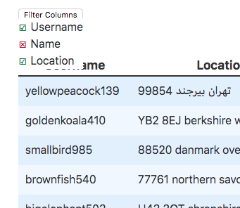

# Column Filter

This demonstrates how you could build a column filter. Have a look at the [ColumnFilter Component](ColumnFilter.svelte).

The ColumnFilters implementation is very basic, you could easily swap it out for a component made out of your favorite Component Library.