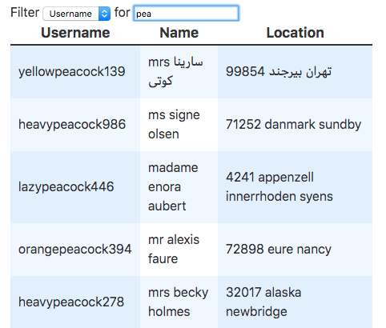

# Filtering Rows

This demonstrates how to filter Rows.

Disclaimer:
The RowFilter in this example is only capable of filtering single Property Paths. This means, that you can only filter for `last_name` in the "Name" Column and only for `location.postcode` in the "Location" Column. This is done, to keep this example simple. It could be changed though.

## Dependencies

This example uses [deep-value](https://github.com/seidme/jsier/tree/master/deep-value) to resolve the Property Paths. You need to install it via `npm i @jsier/deep-value --save` first to make this example work.