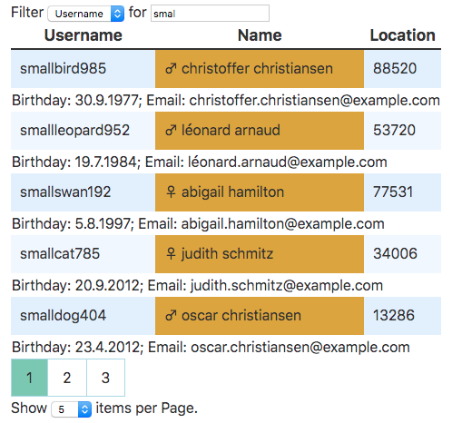

# Full Example

This shows how to use several components together and how they interact with each other.
It shows off a RowFilter with Pagination, Items per Page switch, theming, flexible Rendering..

Disclaimer:
The code could be even more split up into separate Components. I didn't do it, so it's a bit messy.

Have a look at the [code](./App.svelte)!