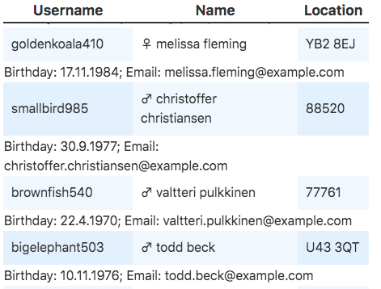

# Flexible Rendering

This demonstrates how flexible columns could be rendered.

The Rendering splits into three groups:
  - If you just want to render data as it is, use [propertyPath](#by-property-path)
  - If your data is almost ready as is, and you just want to add a little detail, use [value](#by-value)
  - If you need full control over how your column should look like, use [slots](#by-slots)
  
If you want, you can render the first column as slot, the second by value and the third by propertyPath. So a mix is possible, but it almost always makes sense to specify `propertyPath`, because the `propertyPath` also used to write column specific css classes.
In case you specified all three methods for one column, only one will be used for rendering. First slots are checked, secondly `value`, and lastly `propertyPath`.

## By Property Path

All you need to do is to add `propertyPath: 'username',` to your column definition (assuming that the property you want to show is `username`).

## By Value

Let's assume you want to display some sports results. Your data contains a `duration` field of how long did it take the runners to complete a marathon. And this duration is because of historic reasons a timestamp in seconds. You now want to show that as 'HH:mm:ss'. You could do that by adding `value: (rowData) => convertToTimeString(rowData.duration)` (assuming that you have a `convertToTimeString` function).

Another use-case is to add the unity of a value. If you have a `avg_speed` field, that contains the runners average speed as float (so without unity), you could add the unity easily. Just set `value: (rowData) => rowData.avg_speed + 'KM/h'`. 

## By Slots

If you have complex data that you want to render you need a slot. You can specify up to 20 slots. The slots are named `column-X`, `X` being the column index.

See [the code example](./App.svelte).