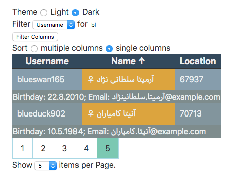

# Stores

This example focuses on clean and concise code. The [App component](./App.svelte) consists of about 100 lines of code, whereas the full Examples [App component](../full/App.svelte) almost need double the amount. This is possible by using Sveltes great store modules.

We use one store per architectural layer:

  - [data-store.js](stores/data-store.js) is the most basic one, fetching the data
  - [sorted-store.js](stores/sorted-store.js) is the second layer, as sorting needs to be done on all rows
  - [filtered-store.js](stores/filtered-store.js) does the filtering on the sorted data
  - [paginated-store.js](stores/paginated-store.js) is the last layer. It maintains the view on a slice of sorted and filtered rows.
  
The stores could even be further improved by using custom stores, which wrap them nicely into custom objects.