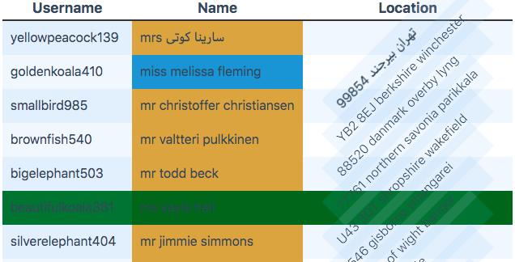

# Theming



ExtendedTable sets a variety of css classes, so that you can style your table easily. Only drawback is that it have to be global styles.
 You can add elements around the component to add more specificity:

```html 
<div>
    <ExtendedTable />
</div>

<style>
div :global(.col-even) {
    // Your styles
}
</style>
```

## Defined CSS-Classes

### Flexible CSS Classes

ExtendedTable writes automatically `row-odd` and `row-even` on every row (`tr`), and `col-odd`, `col-even` and the [sluggified](#sluggifying) propertyPath prefixed with `col-` on every column (`tbody td`). The Slug is generated by replacing all non-alphanumeric characters with underscores.

If you need more flexibility, you can add a `className` prop on the column definition. This prop can be defined for Rows, Columns, and Headlines. It can either be a string or an object with a `propertyPath` and/or a `value` callback function. All resulting values (except for static strings) are [sluggified](#sluggifying) in this process. The handling is a bit different for every Row, Column and Headline:

#### Headline CSS Classes

Written on the `column` prop Object as `headerClassName`, which may be a static String, or a Object that has a `headerClassName.value = (column, columnIndex)` callback. The `column` parameter is your definition of the column. `columnIndex` is the numeric index of the column.

#### Row CSS Classes

Since Version `1.1.0` there is a new prop `rows` that take the row definition (Array of Objects). This is used to write the desired CSS Classes only and differs from the column definition in the way that this definition is applied rolling.
As before, the `className` may be a static String, or an Object. Other than for Headlines, the `className` may have a `propertyPath` that is resolved on the data.
The arguments for the `value` callback are as follows: `data` the current data Object; `row` the current row definition (Object); `rowIndex` the current numerical index.

If you have a row definition like this:
```javascript
let rowDefinition = [
    {className: {propertyPath: 'location.postcode'}},
    {className: {propertyPath: 'username', value: (data, row, rowIndex) => data.last_name}},
    {className: {value: (data, row, rowIndex) => (rowIndex + 1) % 2 === 0 ? 'success' : ''}},
];
```
This means that on the first row (and every following three rows) there will be a CSS Class written that contains the postcode (resolved as propertyPath from the `location` object; this depends on your given data structure).
Every second (and following three rows) will get CSS Classes with `username` and the `last_name` (via callback).
Every even third row (so every six rows) will have a `success` class (beware of zero indexed `rowIndex`).

You need to pass this row definition to your ExtendedTable instance:
```html
<ExtendedTable columns={columnDefinition} data={rows} rows={rowDefinition}></ExtendedTable>
```

#### Column (Cell) CSS Classes

Your column definition Object can now have a `className` property that may either be a String or an Object. The Object may have a `propertyPath` and/or a `value` callback. The callback gets passed in `data` (Object), `columnDefinition` (Object), `columnIndex` (Number) and `rowIndex` (Number).

## Sluggifying

All non-alphanumeric characters will be replaced with underscores in the value.
Let's assume you have a column where you access a nested object `tales.fairy`. This column will have the class `col-tales_fairy`.