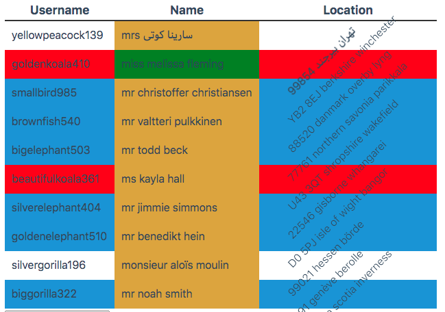

# Theming



ExtendedTable sets a variety of css classes, so that you can style your table easily. Only drawback is that it have to be global styles.
 You can add elements around the component to add more specificity:

```html 
<div>
    <ExtendedTable />
</div>

<style>
div :global(.col-even) {
    // Your styles
}
</style>
```

## Defined CSS-Classes

### Flexible CSS Classes

ExtendedTable writes automatically `row-odd` and `row-even` on every row (`tr`), and `col-odd`, `col-even` and the [sluggified](#sluggifying) propertyPath prefixed with `col-` on every column (`tbody td`). The Slug is generated by replacing all non-alphanumeric characters with underscores.

If you need more flexibility, you can add a `className` prop on the column definition. This prop can be defined for Rows, Columns, and Headlines. It can either be a string or an object with a `propertyPath` and/or a `value` callback function. The resolved `propertyPath` gets [sluggified](#sluggifying) in this process. This does not happen, if you opt for a static string, or use the `value` callback function.
The handling is a bit different for every Row, Column and Headline as explained down below. To see a code example, have a look at the [App.svelte](App.svelte) in this folder.

#### Headline CSS Classes

Written on the `column` prop Object as `headerClassName`, which may be a static String, or a Object that has a `headerClassName.value = (column, columnIndex)` callback.

The arguments for the `value` callback are as follows:

| Parameter     | Type   | Description                                                |
|---------------|--------|------------------------------------------------------------|
| `column`      | Object | column definition object of the column as specified by you |
| `columnIndex` | Number | numerical index of the column                              |
|---------------|--------|------------------------------------------------------------|
| return        | String | the css class names you want to write                      |

#### Row CSS Classes

Since Version `1.1.0` there is a new prop `rowCssClasses` that takes the row definition (Array of Objects). This is used to write the desired CSS Classes only and differs from the column definition in the way that all definitions are applied for each row as long as they return a truthy value.
As before, the `className` may be a static String, or an Object. Other than for Headlines, the `className` may have a `propertyPath` that is resolved on the data.

The arguments for the `value` callback are as follows:

| Parameter     | Type   | Description                                                |
|---------------|--------|------------------------------------------------------------|
| `data`        | Object | data item of the current iteration                         |
| `row`         | Object | the currently matching row definition object of the row    |
| `rowIndex`    | Number | numerical index of the row                                 |
|---------------|--------|------------------------------------------------------------|
| return        | String | the css class names you want to write                      |

If you have a row definition like this:
```javascript
let rowCssClasses = [
  {className: {propertyPath: 'location.postcode'}},
  {className: {value: (data, row, rowIndex) => (rowIndex + 1) % 2 === 0 ? data.last_name : "" }},
  {className: {value: (data, row, rowIndex) => data.title === "mr" ? "male my-other-class" : ""}},
];
```
This means that each row will have a CSS Class that contains the postcode (resolved as propertyPath from the `location` object; this depends on your given data structure) and if the title is "mr", a "male" class will be added. 
On every second row there will be a CSS Classes with the `last_name` (via callback) added.

You need to pass this row definition to your ExtendedTable instance:
```html
<ExtendedTable columns={columnDefinition} data={rows} rowCssClasses={rowCssClasses}></ExtendedTable>
```

#### Column (Cell) CSS Classes

Your column definition Object can now have a `className` property that may either be a String or an Object. The Object may have a `propertyPath` and/or a `value` callback.

The arguments for the `value` callback are as follows:

| Parameter     | Type   | Description                                                |
|---------------|--------|------------------------------------------------------------|
| `data`        | Object | data item of the current iteration                         |
| `column`      | Object | column definition object of the column as specified by you |
| `columnIndex` | Number | numerical index of the column                              |
| `rowIndex`    | Number | numerical index of the row                                 |
|---------------|--------|------------------------------------------------------------|
| return        | String | the css class names you want to write                      |

## Sluggifying

All non-alphanumeric characters will be replaced with underscores in the value.
Let's assume you have a column where you access a nested object `tales.fairy`. This column will have the class `col-tales_fairy`.
